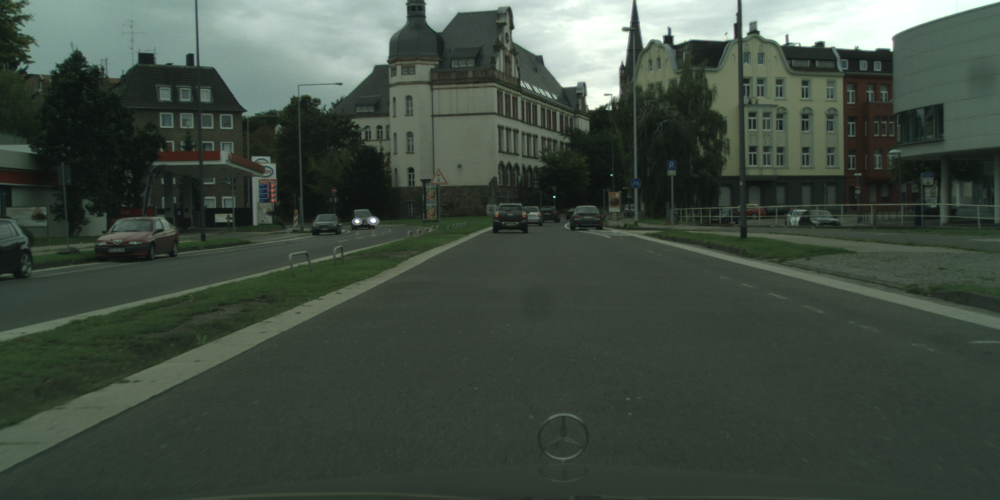
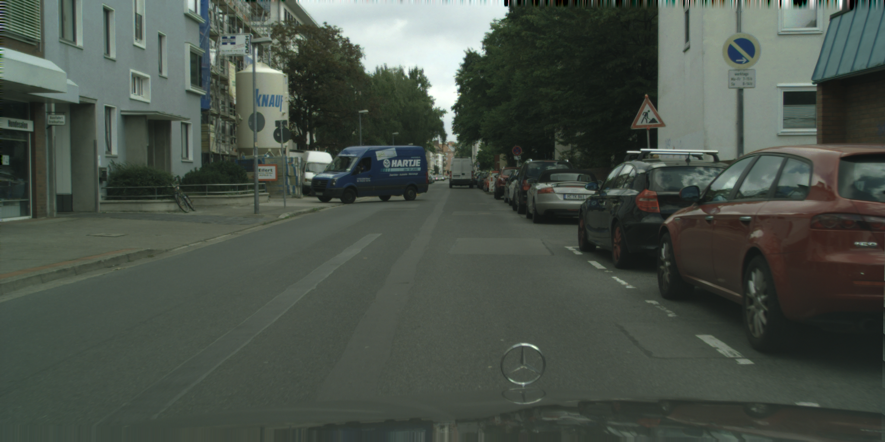
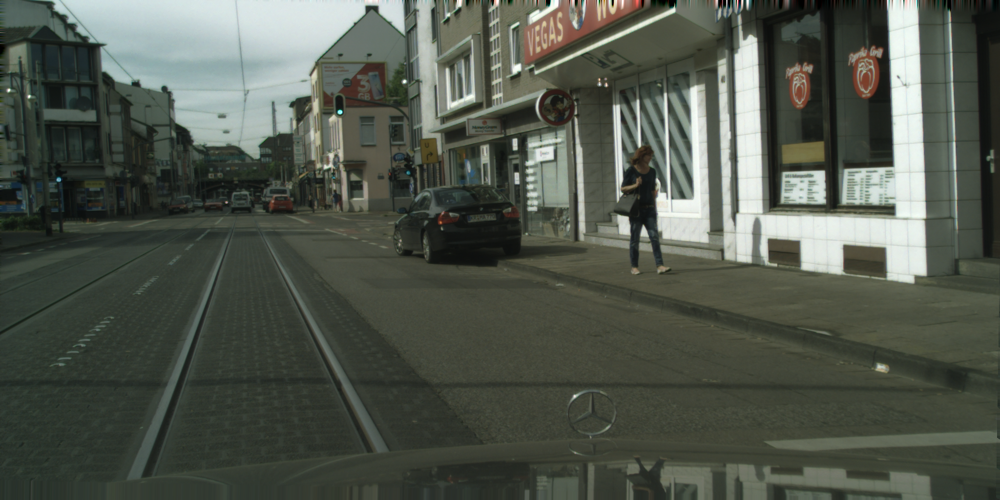
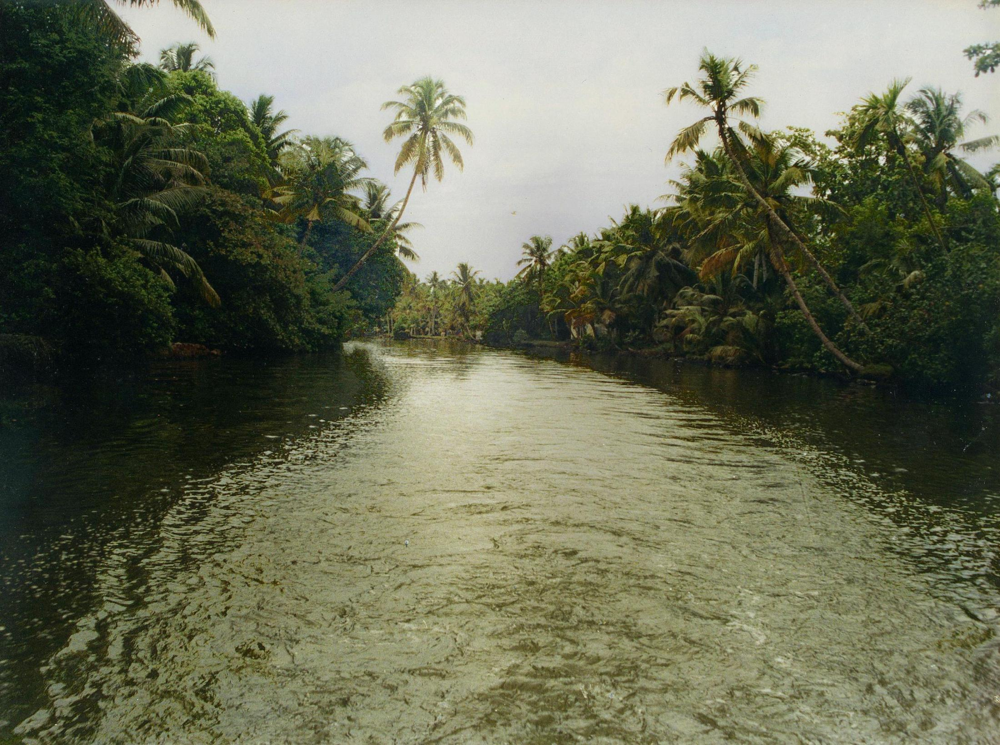
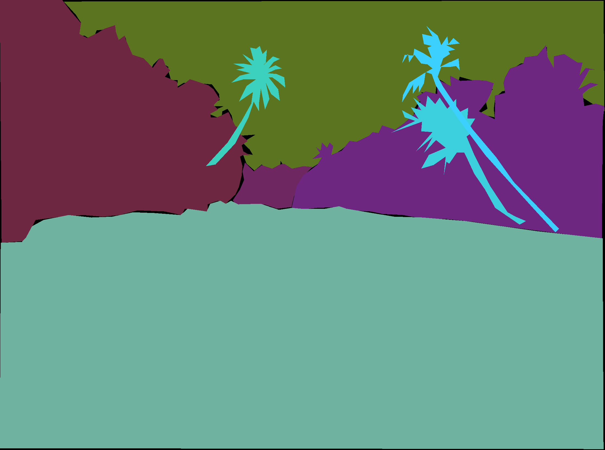
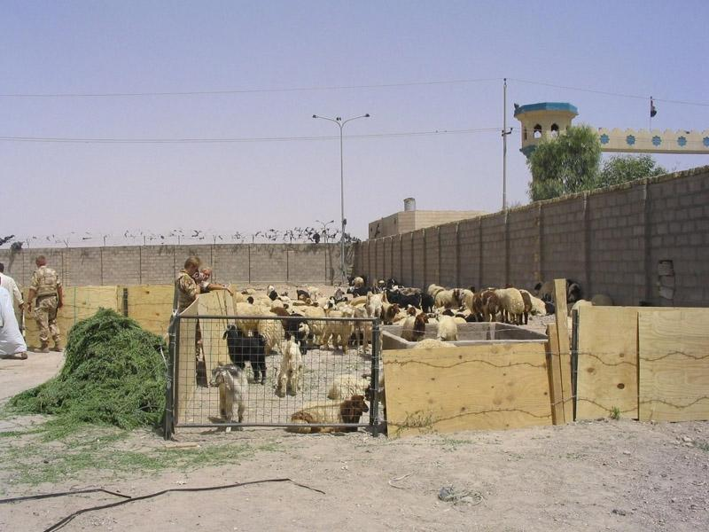
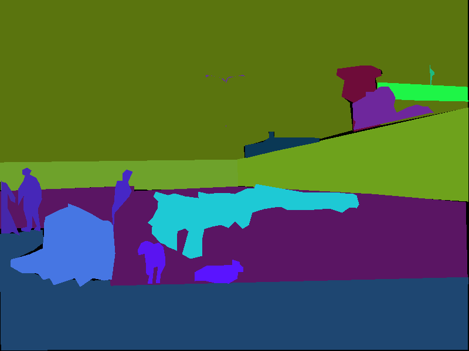
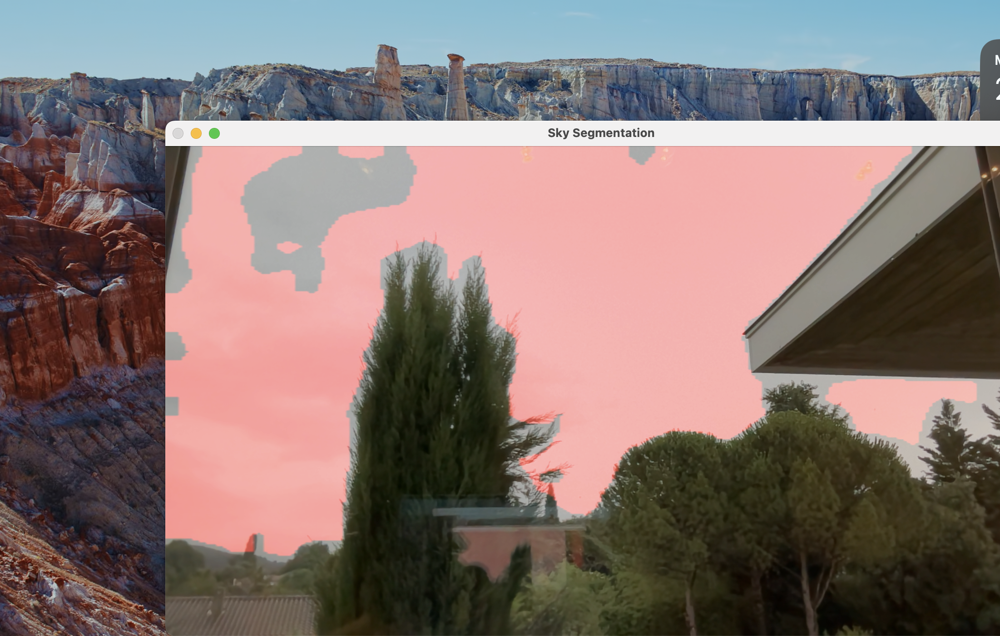

# Panoptic Segmentation Project for Stereolabs Technical Interview

This repository hosts my panoptic segmentation project for the technical interview of stereolabs. 

## Installation
You can install the required packages by running the following command:
```bash
pip install -r requirements.txt
```

## Usage
The src directory contains the code for the project. 
- dataloader.py contains the dataset classes which were used to train models 
- training.py is the script used to train the model
- test.ipynb is a notebook to visualize test results, and to export the trained model to onnx format

There are two inference scripts in the src directory:
- The folder Inference_skyseg_onnx_runtime_cpp contains the code to run the model using onnxruntime and C++
- A python version of the inference script as used as prototype and is named inference.py

The models are stored in the models directory. The model used for the project is named model_segmentation_25_epochs.pth

The dataset directory contains the two datasets used during training : ADE20K and Cityscapes.
You can download the datasets from the following links:
- https://www.cityscapes-dataset.com/downloads/
- https://groups.csail.mit.edu/vision/datasets/ADE20K/

## How to run the inference 

### Running Inference with Python and onnxruntime

To run the inference with python and have real time panoptic segmentation on your webcam stream, you can simply run the following command, preferentially in a virtual environment where you have installed the required packages:
```bash
python src/inference.py
```

### Running Inference with C++ and onnxruntime

To run the inference with C++, you need to build the code in the Inference_skyseg_onnx_runtime_cpp directory. Follow the steps below:

- Install ONNX Runtime: You first need to install the ONNX Runtime library. You can download and install it from the ONNX Runtime GitHub releases. Choose the appropriate version for your system and follow the installation instructions.
- Set Up CMake: Ensure that the ONNX Runtime library is properly included in your CMake configuration. Below is an example CMakeLists.txt file for your reference:

```bash
cmake_minimum_required(VERSION 3.10)
project(SkySegmentation)

set(CMAKE_CXX_STANDARD 11)

find_package(OpenCV REQUIRED)
set(CMAKE_MODULE_PATH ${CMAKE_MODULE_PATH} "${CMAKE_SOURCE_DIR}/cmake")
find_package(onnxruntime REQUIRED)

include_directories(${OpenCV_INCLUDE_DIRS} ${ONNXRUNTIME_INCLUDE_DIRS})

add_executable(SkySegmentation main.cpp)
target_link_libraries(SkySegmentation ${OpenCV_LIBS} ${ONNXRUNTIME_LIBRARIES})
```
Then, you can build the code using the following commands in your terminal or command prompt:

```bash
cd Inference_skyseg_onnx_runtime_cpp
mkdir build
cd build
cmake ..
make
```
Finally, you can run the inference by running the following command:
```bash
./SkySegmentation
```

## Model Architecture
The model used for this project is a pretrained DeepLabV3 model with a ResNet-101 backbone. The model was modified and finetuned on the ADE20K dataset, which contains images with pixel-level annotations for 150 object categories. The finetuning was done on a subset of the ADE20K dataset to perform sky segmentation. The model outputs a binary mask where the sky is segmented from the rest of the image. The deeplabv3 model was chosen for its effectiveness in semantic segmentation tasks and its availability in popular computer vision libraries like PyTorch.


### Dataset details

#### Cityscapes

The Cityscapes dataset, initially used for semantic segmentation of urban scenes, was found to be insufficient for our needs. Initial tests showed poor performance in detecting the sky in webcam images. The uniformity in sky colors in Cityscapes likely led to poor generalization to skies with varying shades and cloud patterns.

Here are a few examples of images from the Cityscapes dataset, showcasing the limited diversity in sky patterns:

<p align="center">
  
  
  
</p>

#### ADE20K

To address this limitation, we adopted the ADE20K dataset, which contains a diverse range of scenes, including both indoor and outdoor images. By filtering for images containing skies, we created a varied dataset that improved the model’s performance on webcam images. The extraction of sky-containing images was done using the annotations available in the dataset’s index file.

Here are some examples of images from the ADE20K dataset, showcasing the diversity in sky patterns, featuring the RGB images and their corresponding segmentation masks:

| Image | Mask |
|-------|------|
|  |  |
|  |  |

Using the rich annotations provided in ADE20K, I filtered the images to include only those containing skies. This was done by identifying images labeled with the ‘sky’ category in the dataset’s annotations. For each selected image, I created a binary mask where the sky pixels were marked as 1 (or 255 in uint8) and all other pixels were set to 0. This involved using the segmentation annotations to accurately generate these masks. To ensure consistency, I resized both images and masks to a standard size, such as 256x256, and normalized the images using the dataset’s mean and standard deviation. These preprocessing steps were integrated into a custom Dataset class compatible with a DataLoader, enabling efficient batching and loading during model training. This approach allowed me to create a diverse and effective training dataset, enhancing the model’s ability to generalize across various sky conditions and improving its segmentation performance in real-world scenarios.

## Training process
The model was trained for 25 epochs on the 3000 randomly sampled images from the ADE20K dataset. It is able to segment the sky and the rest of the image with relatively good accuracy. The model could however be further improved in the future by training on more data and for more epochs, which would likely improve the accuracy of the segmentation.

Tensorboard was used to visualize the training process. Here is a screenshot of the dashboard:


A learning rate of 8e-4 was used for training, and the model was trained using the Adam optimizer. The loss decreased steadily over the epochs, indicating that the model was learning effectively. I used a adaptive learning rate scheduler to adjust the learning rate during training.
The model was trained on a Macbook pro with an arm architecture, M1 pro SoC with 16GB of RAM and 10 cores of CPU. The training took approximately 5 hours to complete. 

Multiple tests were made to assess each intermediary checkpoint of the model. The model that performed the best was the one saved after 25 epochs of training. This model was then used for the inference on the webcam stream.

I first tested the model on individual frames captured with my webcam in scenes where the sky is visible. 

Here are some examples of the model's output on still images from the webcam:


## Results

The model was able to segment the sky from the rest of the image with good accuracy when tested on a live webcam stream. The model was able to generalize well to different sky conditions, making it suitable for real-world applications, despite struggling with some complex sky patterns. 

Here is an screenshot of the model's output on a frame from the webcam stream:



The red overlay represents the sky segmentation, while the rest of the image is shown in its original colors.


## Additional Explanation

### Pretrained Model and Fine-tuning

For this project, we chose to use the DeepLabV3 model with a ResNet-101 backbone pretrained on the COCO dataset. This choice is motivated by the model’s effectiveness in semantic segmentation tasks and its availability in popular computer vision libraries like PyTorch. Fine-tuning a pretrained model allows us to leverage the knowledge gained from large datasets, reducing the need for extensive task-specific training data and speeding up the training process.

### Loss Function

We used Binary Cross-Entropy Loss (BCE) with logits, suitable for our binary segmentation task. This loss function measures the distance between the model’s output and the ground truth, facilitating the optimization of the model for accurate binary mask predictions.


### Technical Constraints

Due to the limited memory of my GPU (16GB of shared RAM), I had to limit the training dataset to 3000 images and perform only a few epochs. Additionally, images were resized to 256x256 to manage these technical constraints.

### Considered Alternatives

Given the absence of an NVIDIA GPU on my local machine, I considered using cloud-based solutions for training and inference. However, I determined that the overhead in latency from sending video streams over the network would be significant, making it suboptimal for real-time applications. Thus, I focused on optimizing the model to run on the available hardware.

### ONNX Runtime Inference Tradeoff

In the absence of an NVIDIA GPU, I used ONNX Runtime for inference instead of TensorRT. ONNX Runtime is a cross-platform, high-performance scoring engine for Open Neural Network Exchange (ONNX) models, which allows for efficient deployment on various hardware, including CPUs and GPUs. This approach provided a viable alternative to TensorRT, enabling real-time inference on my setup. The C++ implementation with ONNX Runtime was specifically chosen to demonstrate the flexibility and capability of running the model efficiently without relying on NVIDIA-specific hardware.

These details elaborate on the considerations and decisions made throughout the project, highlighting the adaptations required to overcome hardware limitations and the rationale behind the chosen methodologies.


### Future Improvements

To further enhance the model’s performance, several improvements can be considered:

- **Data Augmentation**: Implementing data augmentation techniques such as random rotations, flips, and color adjustments can help the model generalize better to diverse sky patterns and lighting conditions.

- **Longer Training**: Training the model for more epochs on a larger dataset can improve its accuracy and robustness. By leveraging more data and training for longer periods, the model can learn more complex features and nuances in sky segmentation. In the current setup, training was limited to 25 epochs due to hardware and time constraints.

